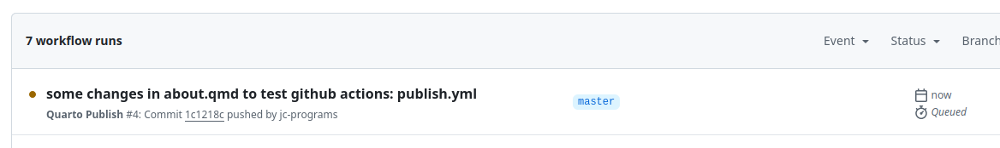
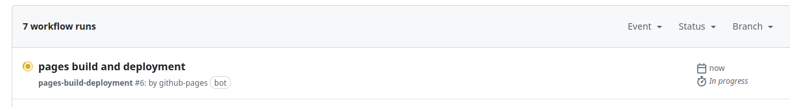
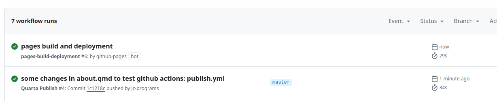

# PRA02

Published on [https://jc-programs.github.io/quarto-prueba/](https://jc-programs.github.io/quarto-prueba/)








```{.yml filename=".github/workflows/publish.yml"}
name: Quarto Publish

on:
  push:
    branches:
      - master
  workflow_dispatch:

jobs:
  build-deploy:
    runs-on: ubuntu-latest
    permissions:
      contents: write
    steps:
      - name: Check out repository
        uses: actions/checkout@v4

      - name: Set up Quarto
        uses: quarto-dev/quarto-actions/setup@v2

      - name: Render and Publish
        uses: quarto-dev/quarto-actions/publish@v2
        with:
          target: gh-pages
        env:
          GITHUB_TOKEN: ${{ secrets.GITHUB_TOKEN }}
```


## Tasks

1. [x] Complete a Local Publish
2. [x] Create a `publish.yml` GitHub Action
