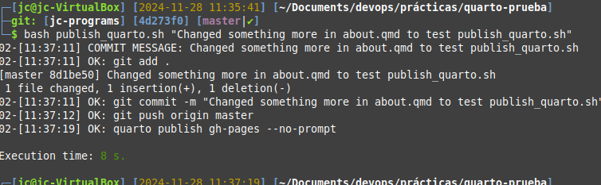

# PRA03

## Explanation

I deleted `.github/workflows/publish.yml` to avoid publication with github actions.

Script execution :
1. Creation of log directory if not exists.
1. Definition of log functions:
    - log_message with 2 arguments:
        1. kind of message
        2. message
    - log_message_error. Only message argument
    - log_message_ok. Only message argument
1. Definition of `count` var to enumerate executions. This var will be stored in a file to get his value in next executions
1. Check if there is a commit message and if it is the only argument
1. Log the commit message
1. Store in a var the current git branch
1. Check if we are in a git repository
1. Check if there is something to commit. If not log it and exit
1. Execute and log `git add`
1. Execute and log `git commmit`
1. Execute and log `git push`
1. Execute and log `quarto publish gh-pages --no-prompt`

## Execution example



## Contents of `publish_quarto.sh`
```{.sh filename="publish_quarto.sh"}
#!/bin/bash

LOG_DIR=logs

# check if log directory exists
if [ ! -d "${LOG_DIR}" ]; then
    # if not then we try to create it
    mkdir "${LOG_DIR}"
    if [ $? -ne 0 ] ; then
        echo "log directory '${LOG_DIR}' does not exist and can't be created."
        exit 1
    fi
fi

log_message() {
    local count=$(printf "%02d" ${COUNT})
    local type="$1"
    local message="$2"
    local timestamp=$(date +"%H:%M:%S")
    echo "${count}-[${timestamp}] ${type}: ${message}" | tee -a "${LOG_FILE}"
}

log_message_error() { 
    log_message "ERROR" "$1" 
}

log_message_ok() {
    log_message "OK" "$1"
}

LOG_FILE=${LOG_DIR}/$(date +"%Y-%m-%d").log
COUNT_FILE=${LOG_DIR}/count

# using a count for better track of different executions
# if log file don't exists => first execution
if [ ! -f "${LOG_FILE}" ]; then
    COUNT=0
    # reset count => Delete count file. No error if not exists
    rm -f -- $COUNT_FILE
else
    # read last value
    read COUNT < $COUNT_FILE 2>/dev/null
    # count file must exists because is not the first execution
    if [ $? -ne 0 ]; then
        COUNT=99
        log_message_error "Can't read count file '$COUNT_FILE'"
        exit 1
    fi
fi
# increment count by 1
(( COUNT++ ))
# write count to count file
echo "$COUNT" > $COUNT_FILE
if [ $? -ne 0 ]; then
    log_message_error "Can't write count to count file '$COUNT_FILE'"
    exit 1
fi

# separating executions in log file with an empty line
if [ "$COUNT" -gt 1 ]; then
    echo >> "${LOG_FILE}"
fi

# Check if the commit message is provided
if [ -z "$1" ]; then
    log_message_error "Please provide a commit message."
    exit 1
fi

# Check if the commit message is the only argument
if [ $# -gt 1 ]; then
    log_message_error "The only admited argument is the commit message."
    log_message_error "If the message is more than a word enclose it with double quotes: \""
    log_message_error "Arguments where '$*'"
    exit 1
fi

# log commit message
log_message "COMMIT MESSAGE" "$1"

# get current branch
BRANCH=$(git branch --show-current 2>/dev/null)
if [ $? -ne 0 ]; then
    log_message_error "git branch --show-current"
    exit 1
fi

# Check if there are some changes to save
# https://stackoverflow.com/questions/3878624/how-do-i-programmatically-determine-if-there-are-uncommitted-changes
GS=$(git status --porcelain=v1 2>/dev/null)
if [ $? -eq 128 ]; then
    log_message_error "There is no git repository in current folder."
    log_message_error "Current folder is: $(pwd)"
    exit 1
fi

if [ -z "${GS}" ]; then
    log_message "INFO" "There are no changes to commit."
    exit 0
fi

git add . 2>/dev/null
if [ $? -ne 0 ]; then
    log_message_error "git add ."
    exit 1
else
    log_message_ok "git add ."
fi

git commit -m "$1" 2>/dev/null
if [ $? -ne 0 ]; then
    log_message_error "git commit -m \"$1\""
    exit 1
else
    log_message_ok "git commit -m \"$1\""
fi

git push origin $BRANCH 2>/dev/null
if [ $? -ne 0 ]; then
    log_message_error "git push origin $BRANCH"
    exit 1
else
    log_message_ok "git push origin $BRANCH"
fi

quarto publish gh-pages --no-prompt 2>/dev/null
if [ $? -ne 0 ]; then
    log_message_error "quarto publish gh-pages --no-prompt"
    exit 1
else
    log_message_ok "quarto publish gh-pages --no-prompt"
fi

exit 0
```


## Contents of `logs/2024-11-28.log`

```{.log filename="logs/2024-11-28.log"}
01-[11:33:59] COMMIT MESSAGE: Changed something to test publish_quarto.sh
01-[11:33:59] OK: git add .
01-[11:33:59] OK: git commit -m "Changed something to test publish_quarto.sh"
01-[11:34:00] OK: git push origin master
01-[11:34:08] OK: quarto publish gh-pages --no-prompt

02-[11:37:11] COMMIT MESSAGE: Changed something more in about.qmd to test publish_quarto.sh
02-[11:37:11] OK: git add .
02-[11:37:11] OK: git commit -m "Changed something more in about.qmd to test publish_quarto.sh"
02-[11:37:12] OK: git push origin master
02-[11:37:19] OK: quarto publish gh-pages --no-prompt

03-[11:43:38] COMMIT MESSAGE: permission to execute publish_quarto.sh
03-[11:43:38] OK: git add .
03-[11:43:38] OK: git commit -m "permission to execute publish_quarto.sh"
03-[11:43:39] OK: git push origin master
03-[11:43:46] OK: quarto publish gh-pages --no-prompt

04-[12:03:12] COMMIT MESSAGE: correct publish_quarto.sh
04-[12:03:12] OK: git add .
04-[12:03:12] OK: git commit -m "correct publish_quarto.sh"
04-[12:03:14] OK: git push origin master
04-[12:03:20] OK: quarto publish gh-pages --no-prompt

05-[12:03:58] COMMIT MESSAGE: check what happens if there is nothing to commit
05-[12:03:58] INFO: There are no changes to commit.

06-[12:06:16] COMMIT MESSAGE: mv .git .git.bak to check error when there is no repo
06-[12:06:16] ERROR: git branch --show-current

07-[12:07:05] COMMIT MESSAGE: mv .git.bak .git to check info when there is repo but no changes
07-[12:07:05] INFO: There are no changes to commit.
```


## Tasks

1. [x] Create the Bash Script
2. [x] Add logging output
3. [x] Make the Script Executable
4. [x] Use the Script

